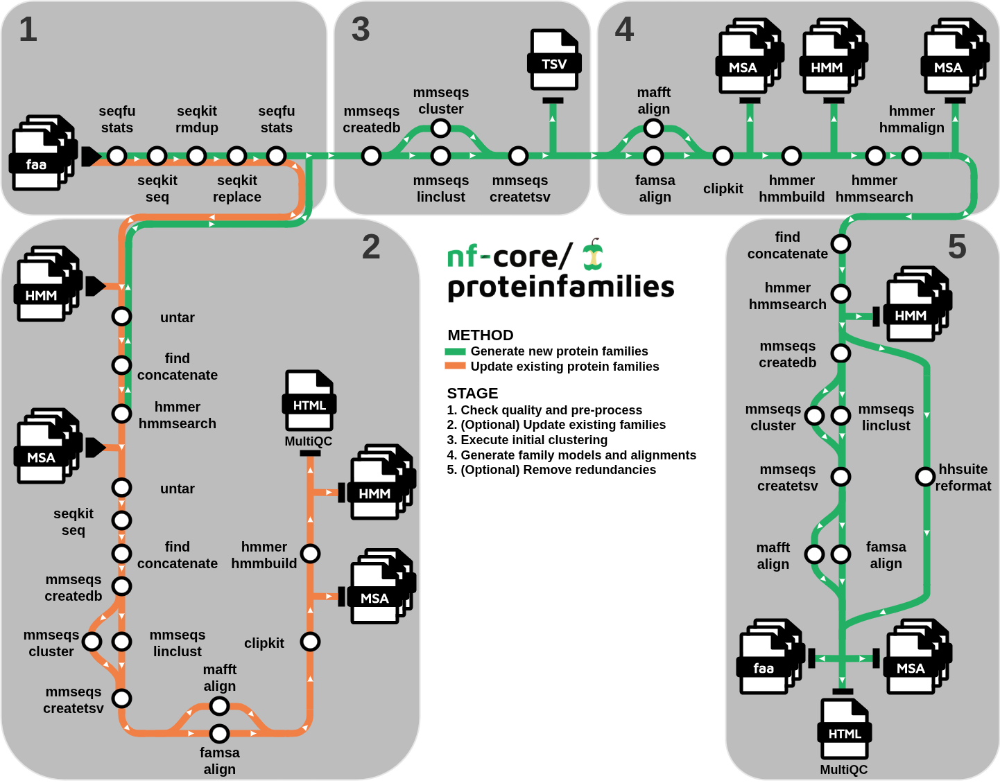

<h1>
  <picture>
    <source media="(prefers-color-scheme: dark)" srcset="docs/images/nf-core-proteinfamilies_logo_dark.png">
    
  </picture>
</h1>

[](https://github.com/nf-core/proteinfamilies/actions/workflows/nf-test.yml)
[](https://github.com/nf-core/proteinfamilies/actions/workflows/linting.yml)[](https://nf-co.re/proteinfamilies/results)[](https://doi.org/10.5281/zenodo.14881993)
[](https://www.nf-test.com)

[](https://www.nextflow.io/)
[](https://github.com/nf-core/tools/releases/tag/3.3.2)
[](https://docs.conda.io/en/latest/)
[](https://www.docker.com/)
[](https://sylabs.io/docs/)
[](https://cloud.seqera.io/launch?pipeline=https://github.com/nf-core/proteinfamilies)

[](https://nfcore.slack.com/channels/proteinfamilies)[](https://bsky.app/profile/nf-co.re)[](https://mstdn.science/@nf_core)[](https://www.youtube.com/c/nf-core)

## Introduction

**nf-core/proteinfamilies** is a bioinformatics pipeline that generates protein families from amino acid sequences and/or updates existing families with new sequences.
It takes a protein fasta file as input, clusters the sequences and then generates protein family Hiden Markov Models (HMMs) along with their multiple sequence alignments (MSAs).
Optionally, paths to existing family HMMs and MSAs can be given (must have matching base filenames one-to-one) in order to update with new sequences in case of matching hits.

<p>
  <picture>
    <source media="(prefers-color-scheme: dark)" srcset="docs/images/proteinfamilies_workflow_dark.png">
    
  </picture>
</p>

### Check quality and pre-process

Generate input amino acid sequence statistics with ([`SeqFu`](https://github.com/telatin/seqfu2/)) and pre-process them with ([`SeqKit`](https://github.com/shenwei356/seqkit/))

### Create families

1. Cluster sequences ([`MMseqs2`](https://github.com/soedinglab/MMseqs2/))
2. Perform multiple sequence alignment (MSA) ([`FAMSA`](https://github.com/refresh-bio/FAMSA/) or [`mafft`](https://github.com/GSLBiotech/mafft/))
3. Optionally, clip gap parts of the MSA ([`ClipKIT`](https://github.com/JLSteenwyk/ClipKIT/))
4. Generate family HMMs and fish additional sequences into the family ([`hmmer`](https://github.com/EddyRivasLab/hmmer/))
5. Optionally, remove redundant families by comparing family representative sequences against family models with ([`hmmer`](https://github.com/EddyRivasLab/hmmer/))
6. Optionally, from the remaining families, remove in-family redundant sequences by strictly clustering with ([`MMseqs2`](https://github.com/soedinglab/MMseqs2/)) and keep cluster representatives
7. Optionally, if in-family redundancy was not removed, reformat the `.sto` full MSAs to `.fas` with ([`HH-suite3`](https://github.com/soedinglab/hh-suite))
8. Present statistics for remaining/updated family size distributions and representative sequence lengths ([`MultiQC`](http://multiqc.info/))

### Update families

1. Find which families to update by comparing the input sequences against existing family models with ([`hmmer`](https://github.com/EddyRivasLab/hmmer/))
2. For non hit sequences continue with the above: A. Create families. For hit sequences and families continue to: 3
3. Extract family sequences ([`SeqKit`](https://github.com/shenwei356/seqkit/)) and concatenate with filtered hit sequences of each family
4. Optionally, remove in-family redundant sequences by strictly clustering with ([`MMseqs2`](https://github.com/soedinglab/MMseqs2/)) and keeping cluster representatives
5. Perform multiple sequence alignment (MSA) ([`FAMSA`](https://github.com/refresh-bio/FAMSA/) or [`mafft`](https://github.com/GSLBiotech/mafft/))
6. Optionally, clip gap parts of the MSA ([`ClipKIT`](https://github.com/JLSteenwyk/ClipKIT/))
7. Update family HMM with ([`hmmer`](https://github.com/EddyRivasLab/hmmer/))

## Usage

> [!NOTE]
> If you are new to Nextflow and nf-core, please refer to [this page](https://nf-co.re/docs/usage/installation) on how to set-up Nextflow. Make sure to [test your setup](https://nf-co.re/docs/usage/introduction#how-to-run-a-pipeline) with `-profile test` before running the workflow on actual data.

First, prepare a samplesheet with your input data that looks as follows:

`samplesheet.csv`:

```csv
sample,fasta,existing_hmms_to_update,existing_msas_to_update
CONTROL_REP1,input/mgnifams_input_small.fa,,
```

Each row contains a fasta file with amino acid sequences (can be zipped or unzipped).
Optionally, a row may contain tarball archives (tar.gz) of existing families' HMM and MSA folders, in order to be updated.
In this case, the HMM and MSA files must be matching in numbers and in base filenames (not the extension).
Hit families/sequences will be updated, while no hit sequences will create new families.

Now, you can run the pipeline using:

```bash
nextflow run nf-core/proteinfamilies \
   -profile <docker/singularity/.../institute> \
   --input samplesheet.csv \
   --outdir <OUTDIR>
```

> [!WARNING]
> Please provide pipeline parameters via the CLI or Nextflow `-params-file` option. Custom config files including those provided by the `-c` Nextflow option can be used to provide any configuration _**except for parameters**_; see [docs](https://nf-co.re/docs/usage/getting_started/configuration#custom-configuration-files).

For more details and further functionality, please refer to the [usage documentation](https://nf-co.re/proteinfamilies/usage) and the [parameter documentation](https://nf-co.re/proteinfamilies/parameters).

## Pipeline output

To see the results of an example test run with a full size dataset refer to the [results](https://nf-co.re/proteinfamilies/results) tab on the nf-core website pipeline page.
For more details about the output files and reports, please refer to the
[output documentation](https://nf-co.re/proteinfamilies/output).

## Credits

nf-core/proteinfamilies was originally written by Evangelos Karatzas.

We thank the following people for their extensive assistance in the development of this pipeline:

- [Martin Beracochea](https://github.com/mberacochea)

## Contributions and Support

If you would like to contribute to this pipeline, please see the [contributing guidelines](.github/CONTRIBUTING.md).

For further information or help, don't hesitate to get in touch on the [Slack `#proteinfamilies` channel](https://nfcore.slack.com/channels/proteinfamilies) (you can join with [this invite](https://nf-co.re/join/slack)).

## Citations

If you use nf-core/proteinfamilies for your analysis, please cite the article as follows:

> **nf-core/proteinfamilies: A scalable pipeline for the generation of protein families.**
>
> Evangelos Karatzas, Martin Beracochea, Fotis A. Baltoumas, Eleni Aplakidou, Lorna Richardson, James A. Fellows Yates, Daniel Lundin, nf-core community, Aydin Buluç, Nikos C. Kyrpides, Ilias Georgakopoulos-Soares, Georgios A. Pavlopoulos & Robert D. Finn
>
> _biorxiv._ 2025 Aug. doi: [10.1101/2025.08.12.670010](https://dx.doi.org/10.1101/2025.08.12.670010).

You can cite the nf-core/proteinfamilies zenodo record for a specific version using the following doi: [10.5281/zenodo.14881993](https://doi.org/10.5281/zenodo.14881993).

An extensive list of references for the tools used by the pipeline can be found in the [`CITATIONS.md`](CITATIONS.md) file.

You can cite the `nf-core` publication as follows:

> **The nf-core framework for community-curated bioinformatics pipelines.**
>
> Philip Ewels, Alexander Peltzer, Sven Fillinger, Harshil Patel, Johannes Alneberg, Andreas Wilm, Maxime Ulysse Garcia, Paolo Di Tommaso & Sven Nahnsen.
>
> _Nat Biotechnol._ 2020 Feb 13. doi: [10.1038/s41587-020-0439-x](https://dx.doi.org/10.1038/s41587-020-0439-x).
